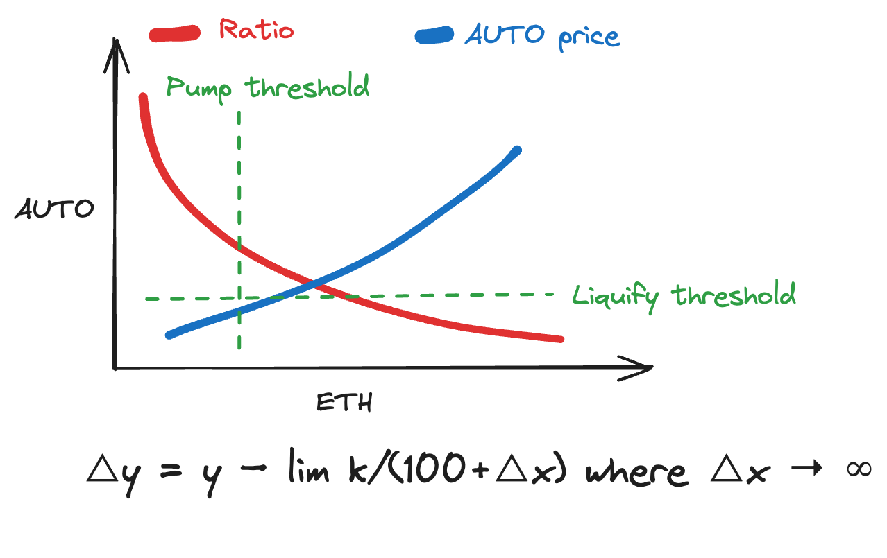

# ⚙️ How AutoPump Works

This pump mechanism, known as Range-Bound Liquidify (RBL), is designed to operate independently on individual tokens. Initially deployed to boost the price of AUTO against ETH, it follows a protocol-enforced range that ensures continuous upward movement. By combining reflection token mechanisms with the auto-pump mechanism, it effectively controls token price volatility for the benefit of both traders and holders.

RBL deploys liquidity in both downward and upward trending markets. This strategy promotes market stability by inducing price contractions and expansions regardless of market conditions.

Liquidity is fundamental to the AUTO pump system, and all liquidity is community-owned. Alongside RBL's market operations, the protocol implements policies to balance liquidity and treasury reserves, maintaining adequate pricing depth.

This ensure a continuous cycle. Collect, accumulate, and when the moment's right, power up the price by buying and burning tokens. No pause, all play.

* **Fee Collection:** With each transaction, AutoPump collects a small fee.
* **AutoPump Fund:** This fee goes into the AutoPump fund, like a piggy bank that's only for buying and burning AutoPump tokens.
* **Trigger Point:** Once the fund hits a set amount, the AutoPump triggers automatically.
* **Buyback and Burn:** AutoPump uses the collected funds to buy back tokens from the market and then burns them, permanently reducing the supply.
